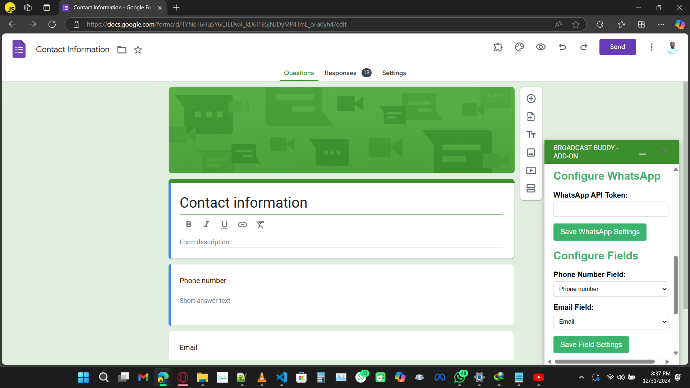

# Broadcast Buddy Google Forms SDK

Broadcast Buddy Google Forms SDK is an integration tool that enhances Google Forms by enabling automated **SMS**, **WhatsApp**, and **Email notifications** whenever a form is submitted. This SDK empowers users to specify phone and email fields for streamlined communication directly from the form responses.

---

## Key Features
- **Automated Notifications**: Send messages via SMS, WhatsApp, and Email upon form submission.
- **Configurable Fields**: Specify phone and email fields in your form for targeted notifications.
- **Seamless Integration**: Works directly with Google Forms for a hassle-free setup.
- **Customizable Messages**: Personalize your notifications to match your workflow.

---

## How It Works
1. **Setup**: Install the Broadcast Buddy SDK for Google Forms.
2. **Configure Fields**: Define the phone number and email fields in your form.
3. **Compose Messages**: Set up your SMS, WhatsApp, and email templates.
4. **Activate**: Enable the SDK to automatically send notifications when a form is submitted.

---

## Benefits
- **Save Time**: Automate communication with form respondents instantly.
- **Improve Efficiency**: Streamline your notification process without manual intervention.
- **Enhanced Engagement**: Keep your audience informed and connected through multiple channels.

---

## Example Use Case
Imagine using Google Forms to collect event registrations. With Broadcast Buddy SDK, you can automatically:
- Send a confirmation email with event details.
- Notify attendees via SMS with quick updates.
- Share a WhatsApp message for easy access to the event location.

---

  
*An example of the Broadcast Buddy configuration dashboard.*

---

## Installation  
1. **Download the SDK**: Download the SDK from [Broadcast Buddy](#).  
2. **Link Form to Sheets**: Link your Google Form to a Google Sheet to capture form responses.  
3. **Open App Script**: In the linked Google Sheet, navigate to `Extensions > Apps Script` and paste the provided SDK code.  
4. **Create Trigger**: Set up an "On Form Submit" trigger in Apps Script to automate notifications.  
5. **Save and Activate**: Save your changes and activate the SDK to start sending notifications.  

---

## Requirements
- A Google account with access to Google Forms.
- API credentials for SMS, WhatsApp, and email services (provided during setup).

---

## Get Started
Ready to enhance your Google Forms? Visit our [official website](broadcastbuddy.app) to learn more and get started with Broadcast Buddy Google Forms SDK today! 